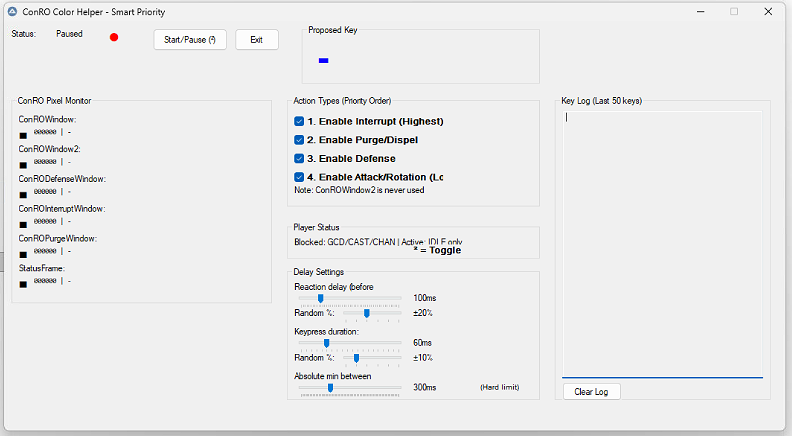

# WoW Pixel Rotation Bot — Proof of Concept

This repository contains a proof-of-concept system that demonstrates how an external helper can automate spell rotations in World of Warcraft by bridging an in-game rotation recommendation addon to an out-of-game input sender using pixel-based signals.

IMPORTANT: This project is intended strictly for research and educational purposes only. It MUST NOT be used on Retail World of Warcraft servers or on any account used for real gameplay. Using automation on Retail is very likely to violate Blizzard's Terms of Service and can lead to permanent account sanctions including bans. Use this project only in controlled environments (offline testing, private servers where allowed, or with explicit permission). Never run automation on accounts you value.

---

## Overview

The system is split into three cooperating components:

1. ConRO (in-game recommendation engine)
   - ConRO is a popular World of Warcraft addon that evaluates player state and recommends the next spells/abilities to cast. See the project page: https://www.curseforge.com/wow/addons/conro

2. `ConRO_Skills` (WoW addon in this repo)
   - This small addon converts ConRO's numeric recommendations into a set of tiny on-screen colored "pixels" (5x5 frames) placed in a fixed location inside the WoW client. Each pixel/frame represents a single recommendation slot and is colored according to ConRO's numeric output.
   - Files in this repo: `Addon/ConRO_Skills/ConRO_Skills.lua`, `Addon/ConRO_Skills/ConRO_Skills.toc`. The addon reads ConRO windows and maps recommendation numbers (0–9) to RGB colors.

3. `RotationSender.au3` (AutoIt script)
   - An AutoIt script (Windows-only) that continuously samples the pixel locations produced by the `ConRO_Skills` addon, converts sampled colors back to recommendation indices and sends corresponding keyboard input to the WoW client to trigger the chosen spell.
   - Important: the actual action indices (which are represented as numbers 0..9 by ConRO and mapped to colors by `ConRO_Skills`) come from ConRO itself — they are not user-configurable inside the sender. Instead, `RotationSender.au3` provides a GUI that controls which categories of ConRO proposals it will act on (for example: enable/disable Interrupts, Purges/Dispels, Defensive actions, or Attack/Rotation). The GUI also exposes timing controls (reaction delay, random % for that delay, keypress duration and its random %, and an absolute minimum delay between keys) so you can tune behaviour and add non-determinism to the timings.
   - File in this repo: `AutoIt/RotationSender.au3`.

The chain is: ConRO -> ConRO_Skills (pixels) -> external pixel reader (AutoIt) -> simulated keypresses.

---

## How it works (detailed dataflow)

1. ConRO evaluates player state and writes a small numeric value (0–9) to its visible recommendation windows.
2. `ConRO_Skills` inspects ConRO's windows and places tiny frames/textures (pixels) in a fixed location on the screen. Each pixel's vertex color encodes a numeric recommendation using a pre-defined color table.
3. The external script samples the screen pixels at the known coordinates and decodes the RGB color back into the numeric recommendation.
4. Based on the decoded recommendation, the external script sends a mapped keyboard key (or macro) to the WoW client to cast the corresponding spell.
5. A special status pixel indicates player casting/channeling/GCD state so the sender can avoid sending keys while the player is casting or during GCD.

This approach keeps the in-game addon legal (it only displays colors), while the decision to issue input is made externally by the user-run program.

---

## Requirements

- World of Warcraft (Retail) client with addon support.
- ConRO addon installed and enabled in-game.
  - ConRO page: https://www.curseforge.com/wow/addons/conro
- Windows machine to run the AutoIt script (AutoIt is Windows-only). If you want to run a similar sender on macOS or Linux, consider porting the AutoIt logic to a cross-platform tool (e.g., Python + pyautogui + Pillow) or use Wine/AutoIt compiled executable at your own discretion.
- Optional: AutoIt v3 (https://www.autoitscript.com/site/) to run or compile `RotationSender.au3`.

---

## Installation

1. WoW addon installation
   - Copy the `Addon/ConRO_Skills` folder into your World of Warcraft `_retail_/Interface/AddOns/` directory.
   - Ensure ConRO is also installed and enabled. `ConRO_Skills` depends on ConRO and is configured to load with it.
   - Setup ConRo: set only display on hostile
   - Bound all your spells to 1-0 keys in the action bar

2. AutoIt script
   - On a Windows machine, open `AutoIt/RotationSender.au3` with SciTE or run it with the AutoIt interpreter.
   - Alternatively compile the script to an executable using Aut2Exe and run the standalone executable.

---

## Usage

1. Start the WoW client and enable both ConRO and ConRO_Skills addons.
2. Position or lock ConRO's window(s) so the pixel frames placed by `ConRO_Skills` are visible at consistent screen coordinates. The Lua addon places small frames relative to `WorldFrame` using coordinates configured inside `ConRO_Skills.lua`.
3. Start the AutoIt `RotationSender` on the same machine where WoW is running (Windows). The script repeatedly reads the pixel colors and sends the mapped keypress when a non-empty recommendation is detected and the status pixel allows it (not casting/GCD/etc.).
   - Use the GUI to enable/disable action categories (priority order) so the sender will only act on the kinds of recommendations you want (e.g., only interrupts and purges, or only rotation/attack actions).
   - Configure the timing sliders to set the base reaction delay, the percentage randomization applied to that delay, keypress duration and its randomization, and an absolute minimum delay between keys. These settings help introduce timing variation and rate-limiting to reduce deterministic behaviour.
4. Observe the automation in action. Calibrate timings and key mapping before using in real encounters.

---

## Files and configuration

- Addon/ConRO_Skills/
  - `ConRO_Skills.lua` — The Lua code that creates pixel frames and maps ConRO's numeric output to RGB colors.
  - `ConRO_Skills.toc` — Addon manifest with dependencies and load order (depends on ConRO).
  - `README.md` — Minimal readme in addon folder.

- AutoIt/
  - `RotationSender.au3` — The AutoIt script that samples pixels and sends keys. Edit this to change pixel sampling coordinates, or tune timing; note that the index→action mapping comes from ConRO and is therefore not directly editable in the sender. The script's GUI exposes the following controls:
    - Action toggles: checkboxes to enable/disable Interrupt, Purge, Defense, Attack (priority order) so you can restrict which ConRO proposals will be acted upon.
    - Reaction delay + random %: base reaction time (ms) and a +/- percent randomization to simulate human variation.
    - Keypress duration + random %: how long keys are held down, with variation.
    - Absolute min between keys: hard limit (ms) preventing keys from being sent too rapidly.

Key configuration notes
- The Lua addon uses an internal color table (10 colors for values 0–9). The AutoIt script must use the same table (or a tolerancing matching strategy) to map sampled RGB back to the numeric value.
- The Lua code includes a status pixel that will be colored to reflect whether the player is casting, channeling, on GCD, or idle. The sender uses this to avoid interrupting animations or sending keys during the GCD.

---

## Calibration and tuning

- Resolution and UI scale: The pixel locations are placed in WoW's UI coordinate space. If you change UI scale, screen resolution, or move ConRO windows, update the pixel coordinates used by the AutoIt script.
- Color sampling tolerance: Colors displayed by WoW may be affected by UI scaling, gamma, or other effects. Use a small tolerance when matching sampled RGB values to the expected color table.
- Timing: Adjust the sampling frequency and any send delays in `RotationSender.au3` to match the latency, server / client timings, and your personal safety margins.

---

## Limitations and safety

- This repository is a Proof-of-Concept. It is not a polished, battle-tested automation tool.
- Automating gameplay is risky: Blizzard's Terms of Service restrict automation that plays the game for you. Use this code only for testing, learning, or in controlled environments (e.g., private servers where allowed, or offline testing).
- Under NO CIRCUMSTANCES should this code be used on Retail WoW. Running this on retail servers risks account suspension or permanent ban.
- Running `RotationSender.au3` requires focus and care. Accidentally sending input may have unexpected consequences.

---

## Attribution and licenses

- `ConRO` addon (recommendation engine) — see https://www.curseforge.com/wow/addons/conro for project and license information. This repo expects ConRO to be installed separately.
- `ConRO_Skills` within this repo was adapted to emit color pixels based on ConRO's visible recommendation windows.
- `RotationSender.au3` relies on AutoIt (https://www.autoitscript.com/site/). AutoIt is provided under its own license.

This repository does not include ConRO itself.